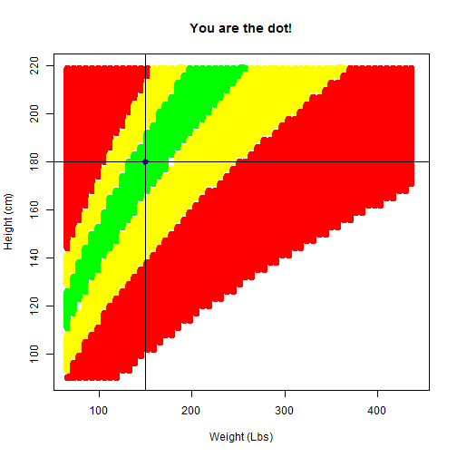

## What is BMI (body mass index)?
The body mass index (BMI), or Quetelet index, is a measure of relative size based on the mass and height of an individual.

The index was devised by Adolphe Quetelet during the course of developing what he called "social physics", between 1830 and 1850.[2] The BMI for a person is defined as their body mass divided by the square of their height—with the value universally being given in units of kg/m2

--- .class #id 

## Purpose
The purpose of this application is to be able to easily calculate your BMI (body mass index).

--- .class #id 

## Posibilities
1. It is posible to choose weight units pounds (Lbs) or kilograms (kg).
2. You have the same option for height units cm (centimeters) or inches.

--- .class #id 

## Graph
A graph is calculated based on selected units, drawing a dot where the users calculated bmi is located in the graph. 
 

--- .class #id 

## Sources and links
Information about bmi and unit conversion have been found at: http://www.wikipedia.com 
The app can be used located here: http://hagser.shinyapps.io/09_DevelopingDataProducts

